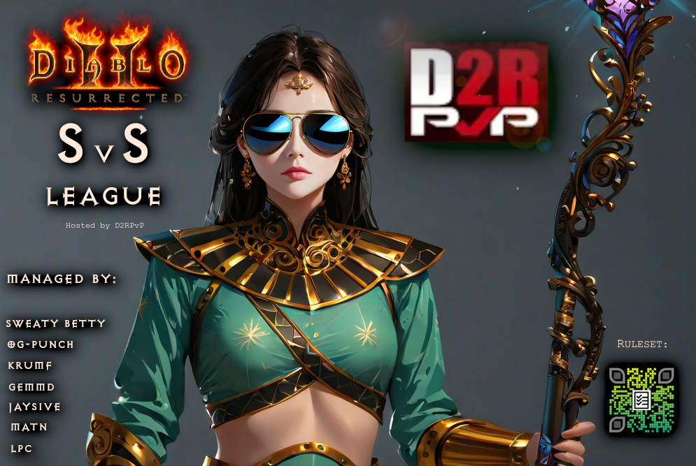

# SvS-Bot-2



SvS-Bot-2 is a Discord bot for managing PvP duel leaderboards in the "SvS" community, using Google Sheets as its database.

## Features

- **Leaderboard System**: View and challenge others on the leaderboard.
- **Game Management**: Register for events and report match outcomes.
- **Role-Based Commands**: Commands are restricted based on assigned roles.

## Prerequisites

- Node.js (latest LTS version)
- Google Cloud project with Google Sheets API access
- Discord bot token

## Project Structure

```
SvS-Bot-2/
|-- commands/                 # Command files (challenge, leaderboard, etc.)
|-- config/                   # Google Sheets API credentials
|-- handlers/                 # Command handler logic
|-- .gitignore                # Ignoring sensitive/unnecessary files
|-- clear-commands.js         # Clear registered bot commands
|-- deploy-commands.js        # Deploy commands to Discord
|-- errorlog.js               # Log errors
|-- googleSheetTest.js        # Google Sheets integration test
|-- index.js                  # Main bot entry point
|-- logger.js                 # Logging module
|-- package.json              # Project dependencies and scripts
|-- README.md                 # Project documentation
```

## Setup

1. **Clone the Repository**
   ```sh
   git clone https://github.com/yourusername/SvS-Bot-2.git
   cd SvS-Bot-2
   ```
2. **Install Dependencies**
   ```sh
   npm install
   ```
3. **Environment Variables** Create a `.env` file in the root directory:
   ```
   DISCORD_TOKEN="your_discord_bot_token_here"
   GOOGLE_CLIENT_EMAIL="your_google_client_email_here"
   GOOGLE_PRIVATE_KEY="your_google_private_key_here"
   SHEET_ID="your_google_sheet_id_here"
   ```
4. **Google Sheets API**
   - Obtain `credentials.json` from Google Cloud Console and place it in `config/`.
   - Share the Google Sheet with the client email.

## Running the Bot

- **Start the Bot**
  ```sh
  node index.js
  ```
- **Deploy Commands**
  ```sh
  node deploy-commands.js
  ```

## Commands

- `/challenge` - Initiate a challenge.
- `/currentchallenges` - Display ongoing challenges.
- `/leaderboard` - Show leaderboard.
- `/nullchallenge` - Nullify a challenge (moderators only).
- `/register` - Register to the leaderboard.
- `/reportwin` - Report duel results.

## Roles

- **@SvS Dueler** - Required for most commands.
- **@SvS Manager** - Required for moderator commands.

## Contribution

- Fork the repository, create a new branch, and submit a pull request.

## License

This project is licensed under the MIT License. See `LICENSE` for details.
